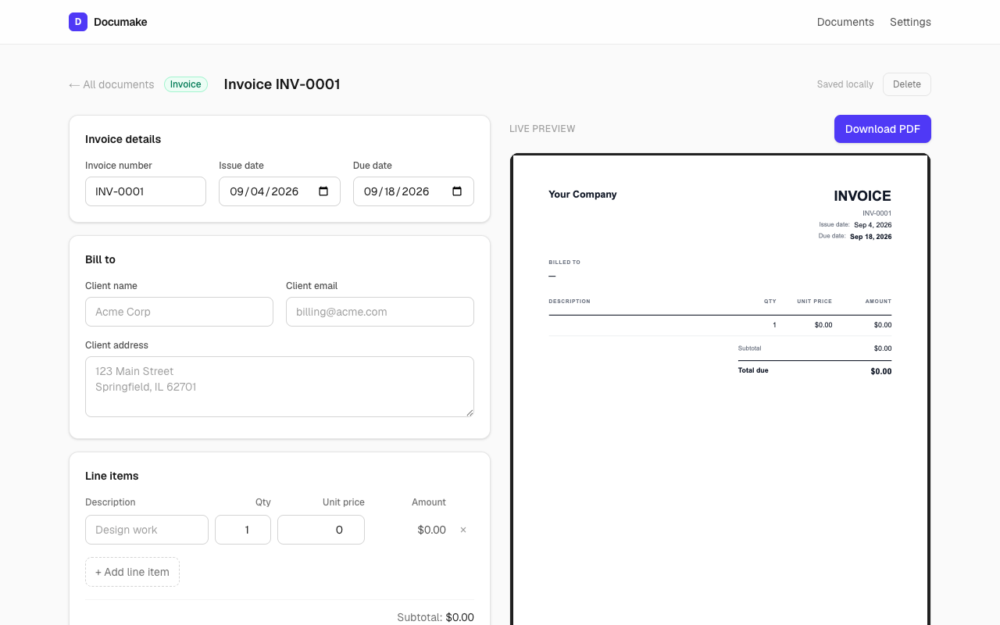

# Documake

Company documents, minus the busywork. Pick a template — invoice, quote,
statement of work, NDA, questionnaire, or report — fill in a form, and download
a polished PDF. Your company details are entered once in Settings and pre-filled
everywhere.

Everything is stored locally in your browser (localStorage). No accounts, no
server, no data leaves your machine.



## Quickstart

Requires Node 22.

```bash
git clone https://github.com/Artem1bar/documake.git
cd documake
npm install
npm run dev
```

Then open the printed localhost URL, pick a template, and fill in the form —
the PDF preview updates as you type. No env vars are needed.

Production build: `npm run build && npm start`. Checks: `npm test` (Vitest,
174 tests) and `npm run lint`.

## How it works

- **Settings** (`/settings`) — one or more brand profiles. Each keeps its own
  company details (name, address, tax ID), invoicing defaults (currency,
  auto-incrementing invoice numbers, payment terms, tax rate), governing law,
  and branding. New documents use whichever profile is active.
- **Branding** — an accent colour and a typeface per profile, applied to the
  document heading and rules. Typefaces are the standard PDF families
  (Helvetica, Times, Courier), so nothing is downloaded or embedded and
  documents render identically anywhere.
- **Dashboard** (`/`) — template cards plus your recent documents.
- **Editor** (`/documents/[id]`) — form on the left, live PDF preview on the
  right, download button. Every change autosaves locally.

## Reports

Most templates are a fixed set of fields. A report is not: it is sections of
typed **blocks** — paragraphs, tables, a costed hours table, lists, checklists,
quotes and callouts — so a new report template is a preset rather than new code.

The one that ships is **The Map**: how work moves through a client's business,
with the manual steps marked and costed. Its six sections carry the authoring
guidance from the template they came from, shown beside each section in the
editor. That guidance is never saved and never printed, so improving a preset
improves reports already written.

The hours table takes a frequency and a duration per step and works out weekly
and annual cost. The working year it assumes lives on the block and prints
under the table, because an unstated assumption is the one that gets argued
with.

A table that breaks across pages repeats its header on each page it spans.

## Architecture

| Layer | Where | Notes |
| --- | --- | --- |
| Schemas & types | `src/lib/types.ts` | Zod-validated at every storage boundary |
| Persistence primitives | `src/lib/persistence/` | Swappable storage adapter, versioned envelopes, migrations |
| Store | `src/lib/storage.ts` | In-memory cache with subscriptions, over an adapter |
| React bindings | `src/lib/store-hooks.ts` | `useSyncExternalStore`-based hooks |
| Invoice math | `src/lib/invoice-math.ts` | Integer-cents arithmetic, tested |
| Report blocks | `src/lib/report/` | Block vocabulary, hours arithmetic, template presets |
| Profiles | `src/lib/profile-store.ts` | Pure operations over the profile list |
| PDF templates | `src/components/pdf/` | `@react-pdf/renderer`, per-profile theme |
| Forms | `src/components/forms/` | One per document type |
| Render API | `src/app/api/render/route.ts` | Stateless PDF rendering for other services |

### Storage

Documents and the company profile persist as versioned envelopes
(`{ version, data }`) behind a `StorageAdapter` — a small synchronous
key-value contract. Today the only implementation is localStorage; swapping in
SQLite or a server backend means writing one adapter and changing one line in
`storage.ts`.

Payloads written by older builds are read as version 1 and migrated forward
through a declared chain. Stored data is treated as untrusted input: anything
absent, corrupt, invalid, or un-migratable falls back to a default rather than
throwing.

## Render API

`POST /api/render` turns a document into a PDF without storing anything, so
other services can generate documents without going through the browser app.

```bash
curl -X POST http://localhost:3000/api/render \
  -H 'Content-Type: application/json' \
  -o invoice.pdf \
  -d '{
    "type": "invoice",
    "filename": "acme-invoice",
    "profile": { "name": "Weblux AI LLC", "currency": "USD" },
    "data": {
      "invoiceNumber": "INV-0042",
      "issueDate": "2026-08-09",
      "billToName": "Acme Corp",
      "items": [{ "id": "1", "description": "Design work", "quantity": 2, "unitPrice": 500 }]
    }
  }'
```

`type` is `invoice`, `quote`, `sow`, `nda`, `questionnaire`, or `report`, and `data` is
validated against that type's schema. `profile` and `filename` are optional. Success returns the
PDF; any failure returns `{ success, data, error }` with a 400, 401, or 500.

**Authentication** is off until you configure it. Set
`DOCUMAKE_RENDER_SECRET` (see `.env.example`) and callers must then send
`Authorization: Bearer <that value>`. Leaving it unset is fine locally, where
only your own machine can reach the endpoint — set it anywhere else.

## Tests

```bash
npm test
```

Vitest covers the money arithmetic (rounding, clamping, float safety), schema
parsing and factories, storage migrations, profile operations, PDF theming, and
the render API end to end.

`scripts/render-samples.tsx` renders sample invoice, NDA, questionnaire and
report PDFs, plus one invoice per brand preset, for visual inspection:

```bash
npx tsx scripts/render-samples.tsx out/
```

## Notes

- The NDA and SOW are general templates, not legal advice — have a lawyer
  review them before relying on them. Neither ships with pre-written terms:
  scope, assumptions, and change control are yours to write.
- Documents live only in the browser that created them. Clearing site data
  deletes them; export anything you need as PDF.

## Roadmap ideas

- Company logo on invoices
- Embedded brand fonts alongside the standard PDF families
- More report presets on the block system: the access checklist, go-live and
  handover (the blocks already carry them)
- More templates (receipt, employment offer)
- DOCX export alongside PDF
- Cloud sync / multi-device (would need a backend)
- E-signature flow for NDAs

## Status

Working and in personal use. Verified on 2026-09-09: install, lint, tests, and
production build all pass with no configuration. Not deployed
publicly — it is local-first by design, so run it on your own machine.

---

Developed with [Claude Code](https://claude.com/claude-code) as the coding agent.
